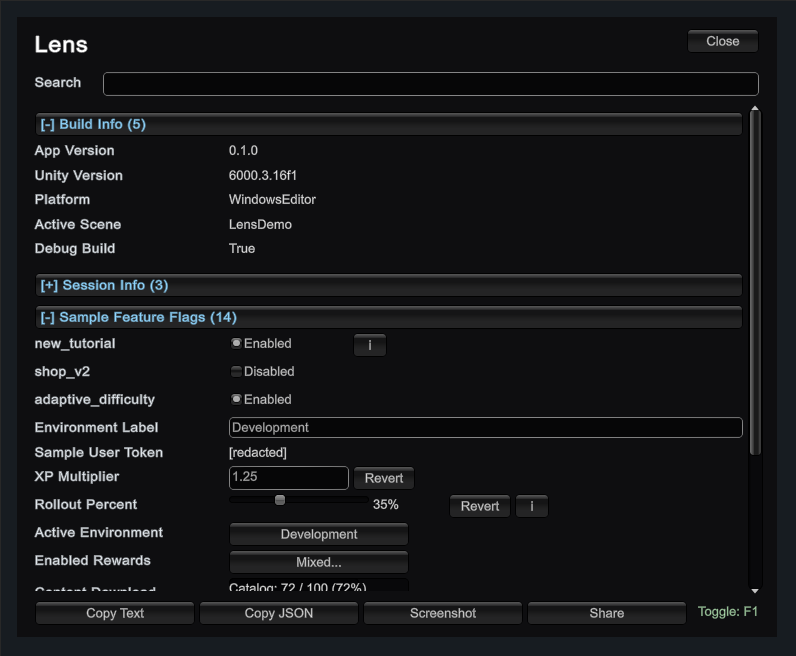
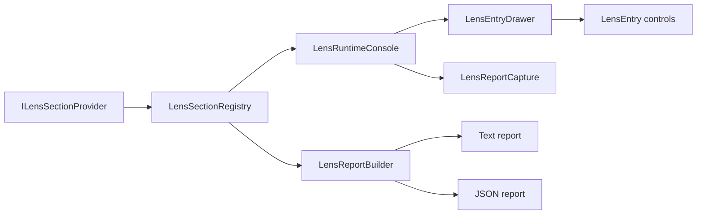
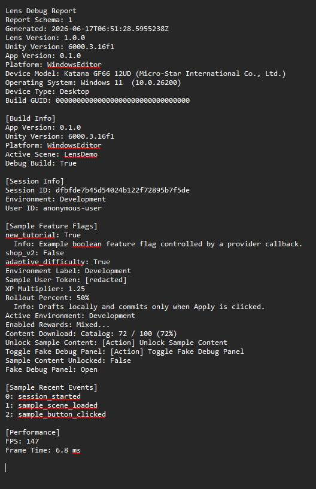
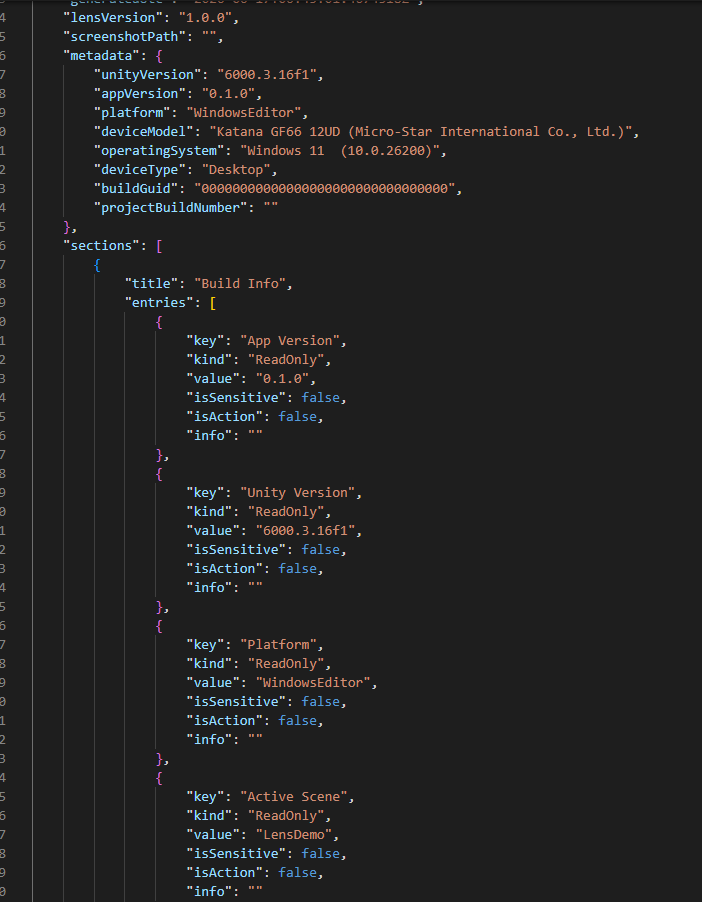

# Lens Runtime Debug Console

[](https://github.com/KostasBan/Lens/actions/workflows/package-validation.yml)
[](https://github.com/KostasBan/Lens/actions/workflows/unity-tests.yml)
[](https://github.com/KostasBan/Lens/releases/tag/v1.1.0)

Lens is a small runtime debug/inspection panel for Unity projects. It helps developers and QA inspect useful in-build state without attaching a debugger, rebuilding custom debug menus, or coupling every system to one UI.

Runtime systems register section providers, Lens renders those sections, and QA can copy text/JSON reports or local screenshots for bug reproduction.

## Preview

[](Docs/media/lens-preview.mp4)

[Watch the Lens preview video](Docs/media/lens-preview.mp4)

Lens groups provider-owned sections, supports folding/search, exposes safe interactive entries, and keeps QA-facing report actions in the footer.

## Quick Start

Install Lens from Git:

```json
{
  "dependencies": {
    "com.kostasban.lens": "https://github.com/KostasBan/Lens.git"
  }
}
```

Register a provider during your bootstrap:

```csharp
using System.Collections.Generic;
using KostasBan.Lens;

public sealed class MyLensSection : ILensSectionProvider
{
    private bool godMode;

    public string SectionTitle => "My Game";

    public IEnumerable<LensEntry> GetEntries()
    {
        yield return new LensEntry("Coins", "120");
        yield return LensEntry.Toggle("God Mode", () => godMode, value => godMode = value);
    }
}

LensSectionRegistry.Register(new MyLensSection());
LensRuntimeConsole.EnsureExists();
```

Create the console once during bootstrap with `LensRuntimeConsole.EnsureExists()`, then press `F1` or use the floating button.

## Use Cases

Use Lens whenever an important runtime value should be visible during development, QA, staging, or controlled internal builds.

Common examples:

- expose the active environment and config source,
- show evaluated feature flags,
- show safe session/debug identifiers,
- list recent gameplay/product events,
- expose performance counters,
- add safe action buttons for project-owned debug tools.

Install the package, add a provider, register it during bootstrap, then open Lens with `F1` or the floating `Lens` button. On mobile portrait screens, Lens scales automatically and switches to a compact stacked layout.

## Why Lens Exists

Many Unity bugs are hard to reproduce because the important runtime context is scattered across systems: build version, active scene, platform, environment, session, feature-like values, recent events, and performance. Lens puts that context into one provider-based overlay that can be used in Editor, development builds, staging, QA, and controlled internal builds.

Lens is deliberately small, extensible, responsive, and easy to attach to QA reports:

- Runtime IMGUI overlay
- `F1` keyboard toggle
- Optional draggable floating button for mobile-friendly activation
- Foldable sections
- Search by section, key, value, or action label
- Provider-based sections
- Read-only, toggle, text, number, and button entries
- Slider, single-select, multi-select, and progress entries
- Custom entry drawers for project-owned controls
- Optional entry info text
- Automatic DPI/screen-aware IMGUI scaling
- Compact stacked layout for mobile portrait screens
- Internal-build enablement policy
- Sensitive entry redaction
- Optional confirmation for action buttons
- Copy-to-clipboard text debug report
- Copy-to-clipboard JSON debug report
- Local screenshot capture for QA evidence
- Native share support for mobile QA retrieval
- Report schema versioning and device/build metadata
- Cached provider refresh to reduce runtime polling
- Basic sample scene
- Provider cookbook samples
- Runtime-safe package tests

## Design Goals

Lens is built as a reusable Unity package, not a one-off project debug menu.

- **Provider-owned data:** systems expose their own sections through `ILensSectionProvider`; Lens does not depend on feature flags, analytics, remote config, or game-specific services.
- **Small dependency-free runtime:** the package uses IMGUI and plain callbacks so it can be dropped into existing Unity projects without pulling in UI frameworks, DI containers, or backend assumptions.
- **Production-aware by default:** runtime policy, redaction, confirmation prompts, and fail-fast debugging keep Lens useful for internal builds without pretending to be a security boundary.
- **QA-focused evidence:** text reports, JSON reports, and local screenshot capture are designed to make bug reproduction easier.
- **Extensible surface:** rich built-in entries cover common controls, while custom entry drawers let consuming projects add their own tools without expanding Lens core.

## Architecture



Providers own data and callbacks. Lens owns rendering, filtering, report generation, and lightweight UI state.

## Reports



Text reports are meant for quick bug tickets, staging checks, and developer handoffs.



JSON reports include a schema version and structured metadata for tooling, automation, or AI-assisted triage.

## Install

Add the package through Unity Package Manager from the Git URL:

```text
https://github.com/KostasBan/Lens.git
```

Or add this entry to your Unity project's `Packages/manifest.json`:

```json
{
  "dependencies": {
    "com.kostasban.lens": "https://github.com/KostasBan/Lens.git"
  }
}
```

## Run The Sample

1. Open your Unity project with Unity `6000.3` or newer.
2. Install Lens through Package Manager.
3. Import the `Basic Lens Demo` sample.
4. Open `LensDemo`.
5. Press Play.
6. Press `F1` or click the floating `Lens` button to open or close Lens.
7. Click `Copy Text`, `Copy JSON`, or `Capture Screenshot` to collect QA evidence.

Lens handles the toggle through IMGUI events, so it does not require the legacy Input Manager or the new Input System package.

The sample registers five providers:

- Build Info
- Session Info
- Sample Feature Flags
- Sample Recent Events
- Performance

The sample feature flag section includes editable toggles, text, numbers, a slider, single-select, multi-select, progress, action buttons, a redacted sample token, info text, and a confirmed unlock action.

The `Provider Cookbook` sample includes dependency-free provider examples for fake remote config values, fake analytics events, and fake content unlock/debug actions.

## Add A Custom Section

Create a provider that implements `ILensSectionProvider`:

```csharp
using System.Collections.Generic;
using KostasBan.Lens;

public sealed class MyGameLensSection : ILensSectionProvider
{
    public string SectionTitle => "My Game";

    public IEnumerable<LensEntry> GetEntries()
    {
        yield return new LensEntry("Coins", "120");
        yield return new LensEntry("Current Level", "3");
        yield return new LensEntry("Difficulty", "Normal");
    }
}
```

If multiple providers can share the same title, implement `ILensIdentifiedSectionProvider` so fold state, entry drafts, popups, and custom drawer state remain stable:

```csharp
public sealed class EconomyLensSection : ILensIdentifiedSectionProvider
{
    public string SectionId => "game.economy";
    public string SectionTitle => "Economy";

    public IEnumerable<LensEntry> GetEntries()
    {
        yield return new LensEntry("Coins", "120");
    }
}
```

Register it at runtime:

```csharp
LensSectionRegistry.Register(new MyGameLensSection());
```

Unregister it when the owner is destroyed:

```csharp
LensSectionRegistry.Unregister(provider);
```

For scene-owned providers, prefer deriving from `LensSectionBehaviour`. It registers in `OnEnable` and unregisters in `OnDisable`, which avoids stale providers when scenes unload or Enter Play Mode runs with domain reload disabled.

```csharp
public sealed class MySceneLensSection : LensSectionBehaviour
{
    public override string SectionTitle => "Scene";

    public override IEnumerable<LensEntry> GetEntries()
    {
        yield return new LensEntry("Wave", "3");
    }
}
```

## Interactive Entries

Providers own all mutations through callbacks. Lens renders controls and invokes callbacks, but it does not store authoritative game state.

```csharp
public sealed class DebugSettingsLensSection : ILensSectionProvider
{
    private bool godMode;
    private string environment = "Development";
    private float coinMultiplier = 1f;

    public string SectionTitle => "Debug Settings";

    public IEnumerable<LensEntry> GetEntries()
    {
        yield return LensEntry.Toggle("God Mode", () => godMode, value => godMode = value);
        yield return LensEntry.Text("Environment", () => environment, value => environment = value);
        yield return LensEntry.Number("Coin Multiplier", () => coinMultiplier, value => coinMultiplier = value);
        yield return LensEntry.Slider("Rollout Percent", () => rollout, value => rollout = value, 0f, 100f, 5f);
        yield return LensEntry.Button("Unlock Content", UnlockContent, true, "Unlock all content?");
    }

    private void UnlockContent()
    {
        // Call project-owned debug code here.
    }
}
```

Button entries are useful for predefined debug actions, such as unlocking content, resetting tutorial state, opening an internal diagnostics panel, or showing a third-party in-game debug console. Lens does not depend on those tools directly; the consuming project wires that behavior in the callback.

Use confirmation for actions that mutate account, progression, inventory, tutorial, economy, or save state.

Text, number, slider, and multi-select entries draft locally and call setters only when applied. Toggle and single-select entries commit immediately when changed.

## Rich Entries

Use explicit option labels so UI, search, and reports stay stable:

```csharp
var environments = new[]
{
    new LensOption<string>("dev", "Development"),
    new LensOption<string>("stage", "Staging")
};

yield return LensEntry.SingleSelect("Environment", () => environment, value => environment = value, environments);
yield return LensEntry.MultiSelect("Rewards", () => rewards, values => rewards = values.ToList(), rewardOptions);
yield return LensEntry.Progress("Download", () => downloadedMb, () => totalMb, "Catalog");
```

Add info text when a value needs context:

```csharp
yield return LensEntry.Toggle("shop_v2", () => shopV2, value => shopV2 = value, infoText: "Controls the new shop flow.");
```

## Custom Entries

Register a project-owned IMGUI drawer for custom entry types:

```csharp
LensEntryDrawerRegistry.Register("my.graph", new MyGraphDrawer());

yield return LensEntry.Custom(
    "Spawn Graph",
    "my.graph",
    payload: graphData,
    displayValue: payload => "Graph available",
    searchText: payload => "spawn graph diagnostics",
    reportValue: payload => "Graph available");
```

Custom drawer exceptions are not swallowed. Lens is a debug tool, so failures should surface with useful Unity stack traces.

Custom drawers can inspect `LensEntryDrawContext.UiScale`, `IsCompact`, `LogicalScreenWidth`, and `LogicalScreenHeight` to adapt their own IMGUI controls.

## Responsive UI

Lens defaults to automatic scaling:

```csharp
var console = LensRuntimeConsole.EnsureExists();
console.UiScaleMode = LensUiScaleMode.Auto;
console.RefreshIntervalSeconds = 0.25f;
```

Prefer one bootstrap-created console per app. `LensRuntimeConsole.EnsureExists()` returns an existing console when one is already loaded, otherwise it creates a new `Lens Runtime Console` object. If you place console prefabs in scenes manually, make sure your project avoids duplicate consoles.

For project-specific tuning, use fixed scale or auto-scale clamps:

```csharp
console.UiScaleMode = LensUiScaleMode.Fixed;
console.FixedUiScale = 1.5f;
console.SetAutoScaleLimits(1f, 3f);
```

The default auto mode uses DPI when available, falls back to portrait screen size when DPI is unavailable, and clamps scale to avoid unreadably small or oversized UI.

## Provider Performance

Lens caches section entries while the console is open and refreshes them on an interval. The default refresh interval is `0.25` seconds:

```csharp
console.RefreshIntervalSeconds = 0.25f;
console.RefreshNow();
```

Set `RefreshIntervalSeconds` to `0` if a project needs every visible IMGUI pass to rebuild provider entries.

Providers should still keep `GetEntries()` cheap. Avoid slow service calls, large allocations, file IO, network requests, or expensive scene scans inside `GetEntries()`. Expensive systems should cache their own snapshots and expose those snapshots through Lens providers.

For providers that refresh often, cache mutable entries and delegates in the provider constructor, then yield the cached entries:

```csharp
public sealed class FlagsLensSection : ILensSectionProvider
{
    private bool godMode;
    private readonly LensEntry godModeEntry;

    public FlagsLensSection()
    {
        godModeEntry = LensEntry.Toggle("God Mode", () => godMode, value => godMode = value);
    }

    public string SectionTitle => "Flags";

    public IEnumerable<LensEntry> GetEntries()
    {
        yield return godModeEntry;
    }
}
```

Lens is intended to be used from Unity's main thread. Providers should expose frame-synchronized snapshots rather than doing work from background threads.

## Internal Build Policy

Lens is enabled by default only for Editor, Development Build, or builds compiled with `LENS_ENABLED`:

```csharp
if (LensRuntimePolicy.IsAllowed)
{
    LensSectionRegistry.Register(new MyGameLensSection());
}
```

Projects can override this at runtime for their own internal bootstrap:

```csharp
LensRuntimePolicy.SetAllowed(true);
LensRuntimePolicy.ResetToDefault();
```

`LensRuntimeConsole.Open()` and `Toggle()` do nothing when Lens is not allowed. `Close()` always works.

## Redacted Entries

Mark sensitive values explicitly. Lens keeps the raw value available to the provider-owned callback path, but the overlay, search, and copied reports use the redacted display value.

```csharp
yield return LensEntry.Text("User Token", () => token, value => token = value, true);
yield return new LensEntry("Install Id", installId, true);
```

Redaction is a safety aid, not a security boundary. Do not expose secrets, auth tokens, payment data, private player data, or anything that should never exist in an internal debug overlay.

## Debug Reports

Lens builds readable plain text and JSON reports from the currently registered providers:

```text
Lens Debug Report
Report Schema: 1
Generated: 2026-06-09T12:30:00.0000000Z
Lens Version: 1.1.0
Unity Version: 6000.3.16f1
App Version: 0.1.0
Platform: WindowsEditor
Device Model: Editor
Operating System: Windows
Device Type: Desktop
Build GUID:

[Build Info]
App Version: 0.1.0
Unity Version: 6000.3.16f1
Platform: WindowsEditor
Active Scene: LensDemo
Debug Build: True
```

This is useful for QA bug reports, staging checks, and quick developer handoffs.

Interactive values are reported using their current callback values. Action buttons are listed as available actions and are never executed while building a report.
Sensitive values are reported as `[redacted]`.

The console footer provides:

- `Copy Text` for a human-readable report.
- `Copy JSON` for structured QA or automation handoff.
- `Capture Screenshot` for a local PNG saved under `Application.persistentDataPath/LensReports`; the screenshot path is copied to the clipboard.
- `Share` for exporting text/JSON/screenshot artifacts and invoking native share on supported mobile platforms.

JSON reports use this shape:

```json
{
  "schemaVersion": 1,
  "generatedUtc": "2026-06-09T12:30:00.0000000Z",
  "lensVersion": "1.1.0",
  "screenshotPath": "",
  "metadata": {
    "unityVersion": "6000.3.16f1",
    "appVersion": "0.1.0",
    "platform": "WindowsEditor",
    "deviceModel": "Editor",
    "operatingSystem": "Windows",
    "deviceType": "Desktop",
    "buildGuid": "",
    "projectBuildNumber": ""
  },
  "sections": [
    {
      "title": "Build Info",
      "entries": [
        {
          "key": "App Version",
          "kind": "ReadOnly",
          "value": "0.1.0",
          "isSensitive": false,
          "isAction": false,
          "info": ""
        }
      ]
    }
  ]
}
```

Code can also request a specific report format:

```csharp
LensReportMetadata.ProjectBuildNumber = "qa-2048";

var text = LensReportBuilder.BuildReport(LensSectionRegistry.Providers, LensReportFormat.Text);
var json = LensReportBuilder.BuildReport(LensSectionRegistry.Providers, LensReportFormat.Json);
var artifact = LensReportExporter.Export(LensSectionRegistry.Providers);
```

## Production Notes

Lens is intended for Editor, Development Builds, or explicitly enabled internal builds.

For later versions, a project can wrap Lens initialization with:

```csharp
#if UNITY_EDITOR || DEVELOPMENT_BUILD || LENS_ENABLED
// Register Lens providers or create the Lens console.
#endif
```

Do not expose secrets, auth tokens, or private player data through custom providers.

## Future Integrations

Lens is designed so future systems can register their own sections without becoming package dependencies:

- Beacon can expose active environment, config source, config version, and evaluated feature flags.
- Pulse can expose recent analytics events, event counts, session context, and funnel/debug state.
- Signal can attach Lens debug reports to smoke-test or QA output.

These integrations are intentionally out of scope for Lens core. See `Docs/future-integrations.md` for integration sketches.

## Roadmap

Near-term ideas:

- Configurable mobile activation gestures, such as a multi-finger long press.
- Unity CI matrix across supported Unity versions.
- Console log capture.
- Local flag overrides.
- Bug report form or backend handoff.
- Optional adapters for project DI patterns such as Zenject.
- Optional richer UI path if IMGUI becomes limiting, while keeping provider APIs UI-agnostic.

Already addressed in the stable line: screenshots, mobile report retrieval, schema versioning, domain-reload-off reset, `LensSectionBehaviour`, redaction, provider allocation guidance, wrong-kind guards, and main-thread-only documentation.

## For Agents And Contributors

- See `AGENTS.md` for repo-level coding-agent guidance.
- See `Docs/api-overview.md` for the public API overview.
- See `Docs/agent-usage.md` for how agents should expose important runtime values in consuming Unity projects.
- See `Docs/architecture-decisions.md` and `Docs/future-integrations.md` for design rationale and integration sketches.
- See `SECURITY.md` for internal-build safety guidance.
- See `CONTRIBUTING.md` for validation and versioning guidance.

The public package validation workflow is always runnable. Unity EditMode tests run when repository Unity license secrets are configured; otherwise that workflow reports a skipped Unity test run.

## License

MIT
